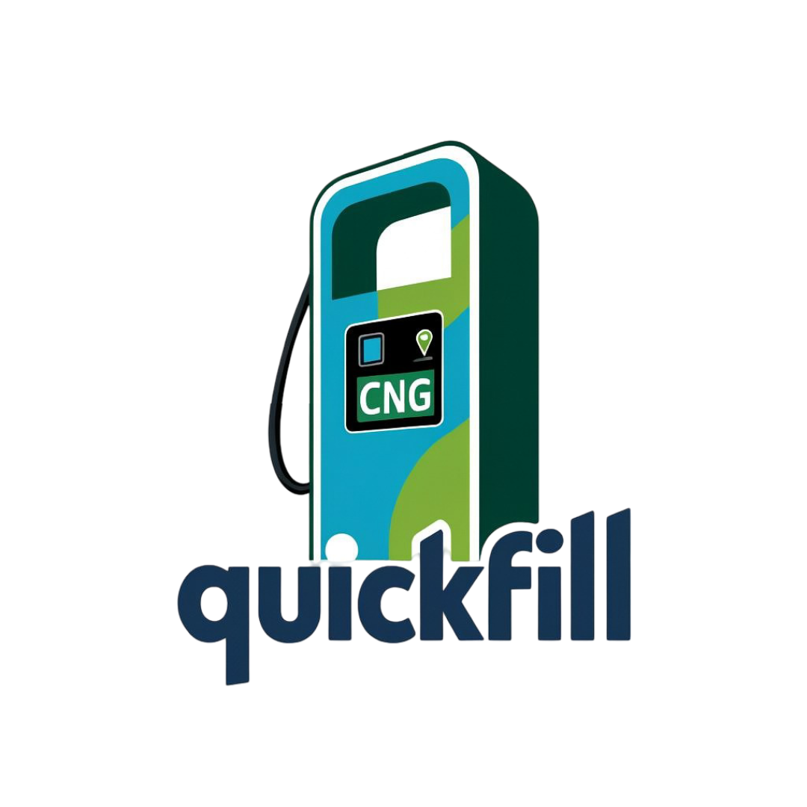

<p align="center">
  
</p>

# QuickFill - CNG Station Dashboard 🚗⛽

[](https://choosealicense.com/licenses/mit/)
[](https://www.python.org/)
[](https://flask.palletsprojects.com/)

QuickFill is a modern, user-friendly dashboard for finding and managing CNG stations. Our platform makes CNG vehicle refueling accessible and convenient for everyone.


## 📑 Table of Contents

- [Features](#features)
- [Tech Stack](#tech-stack)
- [Installation](#installation)
- [Usage](#usage)
- [Project Structure](#project-structure)
- [Contributing](#contributing)
- [Team](#team)
- [License](#license)
- [Contact](#contact)

## ✨ Features

- 🗺️ Interactive CNG station map
- 📊 Real-time station availability
- 📱 Responsive dashboard design
- 🔍 Advanced search and filtering
- 📈 Usage analytics and statistics
- 👥 User profile management

## 🛠️ Tech Stack

- **Frontend**: HTML5, CSS3, JavaScript
- **Backend**: Python, Flask
- **Database**: SQLite/PostgreSQL
- **Authentication**: Flask-Login
- **Maps Integration**: Leaflet.js
- **UI Framework**: Custom CSS with Animate.css

## 🚀 Installation

1. Clone the repository:
```bash
git clone https://github.com/yourusername/quickfill.git
cd quickfill
```

2. Create and activate virtual environment:
```bash
python -m venv venv
source venv/bin/activate  # Linux/Mac
venv\Scripts\activate     # Windows
```

3. Install dependencies:
```bash
pip install -r requirements.txt
```

4. Set up environment variables:
```bash
cp .env.example .env
# Edit .env with your configuration
```

5. Initialize the database:
```bash
flask db upgrade
```

## 💻 Usage

1. Start the development server:
```bash
flask run
```

2. Open your browser and navigate to:
```
http://localhost:5000
```

## 📁 Project Structure

```
quickfill/
├── static/
│   ├── css/
│   │   ├── style.css
│   │   └── dashboard.css
│   ├── js/
│   └── images/
├── templates/
│   ├── dashboard.html
│   ├── home.html
│   └── components/
├── app.py
├── models.py
└── requirements.txt
```

## 🤝 Contributing

We welcome contributions! Please follow these steps:

1. Fork the repository
2. Create your feature branch (`git checkout -b feature/AmazingFeature`)
3. Commit your changes (`git commit -m 'Add some AmazingFeature'`)
4. Push to the branch (`git push origin feature/AmazingFeature`)
5. Open a Pull Request

## 👥 Team

- **Aryan Sharma** - Developer - [LinkedIn](https://www.linkedin.com/in/adhax)
- **Abhishek Gaur** - Developer - [LinkedIn](https://www.linkedin.com/in/krish-goyal)
- **Anand Mishra** - UI/UX Designer - [LinkedIn](https://www.linkedin.com/in/aryan-sharma-9a84142bb)
- **Aparna Pandey** - Developer - [LinkedIn](www.linkedin.com/in/aparna-pandeyy)
- **Vishal Dubey** - Research Analyst - [LinkedIn](https://www.linkedin.com/in/vishal-dubey-8218052a6)

## 📄 License

This project is licensed under the MIT License - see the [LICENSE](LICENSE) file for details.

## 📞 Contact

- Website: [quickfill.com](https://quickfill.com)
- Email: aryansharma35x@gmail.com
- Location: Sharda University, Greater Noida
- Phone: +91 9412678204

---

<p align="center">Made with ❤️ by the QuickFill Team</p>
